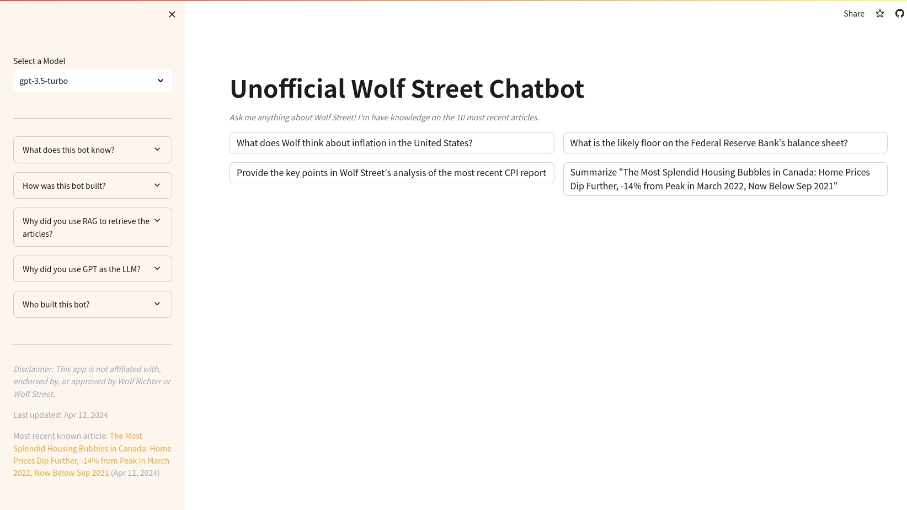

# UnofficialWolf Street Chatbot
[](https://github.com/benfwalla/BenThompsonChatbot/actions/workflows/check_for_latest_articles.yml)

## 🎈 [Use on Streamlit now!](https://unofficial-wolfstreet-chatbot.streamlit.app/)


Note: I've run into storage limitations on the Chromadb file (Git LFS is now required) so I am no no longer aggregating new content in the Strealit deployment. This is now just for reference.

If you want to fork this repo, you should instead clone it and create a new one. You can't apply Git LFS to a downstream fork, and I was faced with either deleting and recreating this repo, or stopping aggregation. 

## What does this bot know?
The bot knows about Wolf Richter, Wolf Street, and the [Wolf Street](https://wolfstreet.com/) articles listed in [data.json](data.json). 
The oldest known article dates back to 05 Apr 2024.

## How was this bot built?
- Wolf Street articles were saved as markdown files, split into smaller chunks, and embedded in a [Chroma](https://www.trychroma.com/) database.
- On (almost) every query, the bot embeds your query, identifies the 7 most similar article chunks and 0-3 most relevant article summaries and places them into GPT's context to answer your question. This technique is known as *[Retreival-Augmented Generation (RAG)](https://stackoverflow.blog/2023/10/18/retrieval-augmented-generation-keeping-llms-relevant-and-current/)*.
- RAG is far from perfect! I used the open-sourced [`all-MiniLM-L6-v2`](https://huggingface.co/sentence-transformers/all-MiniLM-L6-v2) model to create the embeddings. I used it because it's free (I'm cheap) and has [good speed and performance](https://huggingface.co/blog/mteb) for what you're getting.
- I removed all those markdown Wolf Street articles from this repo out of respect to Wolf Richter.

### [data.py](data.py)
data.py is a mess of a codebase that shows how I retrieved, chunked, and embedded the Wolf Street articles

### [chatbot.py](chatbot.py)
chatbot.py is the UI logic for the Streamlit chatbot.

### [chatbot_helper.py](chatbot_helper.py)
chatbot_helper.py is the helper functions for the Streamlit chatbot. This is where the magic happens with the GPT chat completions.

## Who built this bot?
This bot was built by [Gordon Weakliem](https://github.com/gweakliem). He's been a Wolf Street reader for about 4 years and donates to the site. He wanted to learn more about AI chatbots and RAG and this code was forked from the [StratecheryChatbot](https://unofficial-stratechery-chatbot.streamlit.app/), a GPT bot that uses RAG to answer questions about the Stratechery weblog.

_Disclaimer: This app is not affiliated with, endorsed by, or approved by Wolf Richter or Wolf Street._

## Develpment Notes

The original StratecheryChatbot that this was forked from used the pysqlite3-binary package. This package does not provide binaries for Apple Silicon (M1/M2...), so I had to use pysqlite3 instead. To install the depenedencies on OSX, install sqlite3 with `brew install sqlite3` and then set the environment like this:

```
export LDFLAGS="-L/opt/homebrew/opt/sqlite/lib"
export CPPFLAGS="-I/opt/homebrew/opt/sqlite/include"
```

Simon Willison also has some [related info](https://til.simonwillison.net/sqlite/pysqlite3-on-macos) that was helpful in debugging this.